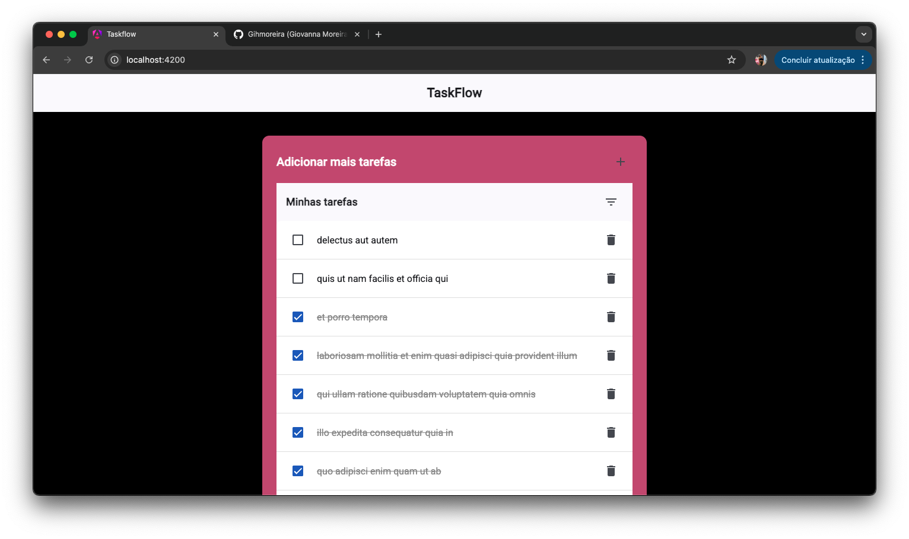
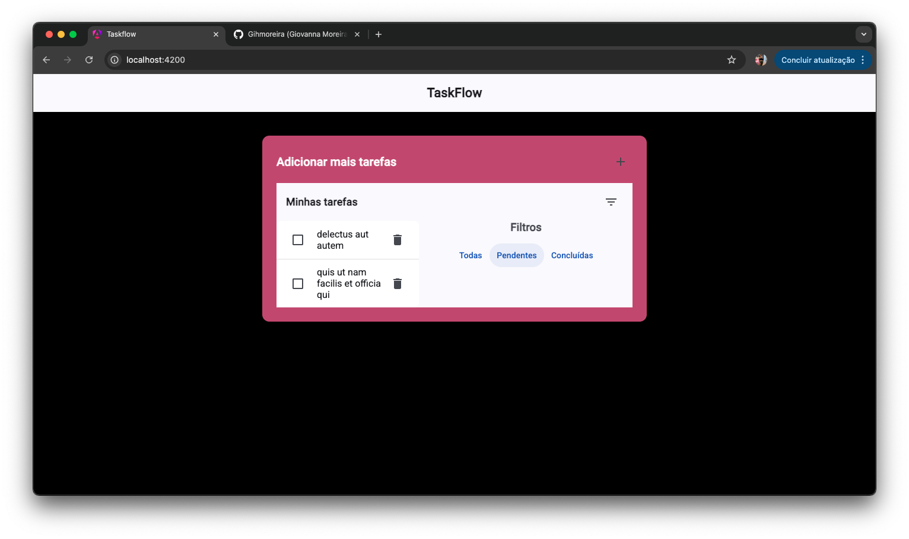
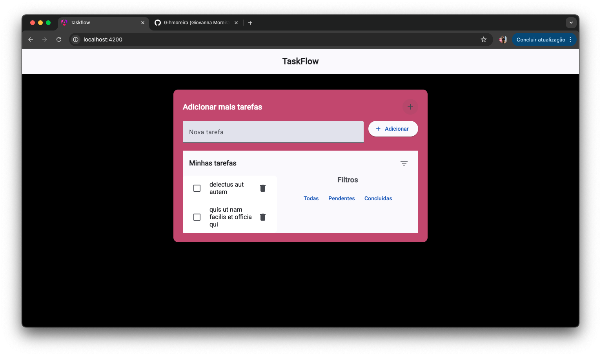
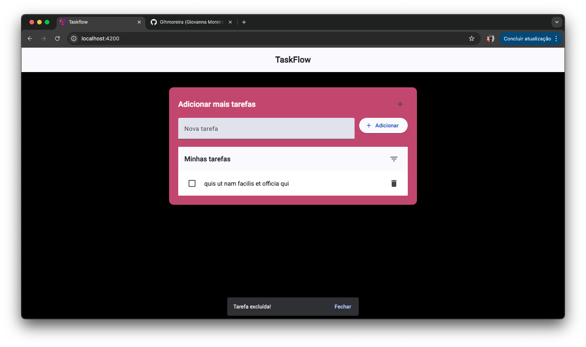

# Taskflow

This project was generated using [Angular CLI](https://github.com/angular/angular-cli) version 19.0.7.
Um gerenciador de tarefas simples feito com Angular 19, Angular Material e RxJS.
Permite adicionar, listar, filtrar e excluir tarefas, com persistência em localStorage e integração com API de exemplo https://jsonplaceholder.typicode.com/todos

## 🚀 Tecnologias usadas
- Angular CLI v19.0.7
- Angular Material (toolbar, drawer, ícones, checkboxes, snackbar)
- RxJS (BehaviorSubject para estado reativo)
- LocalStorage para persistência
- HttpClient para consumo de API externa

## 🛠️ Scripts úteis
- ng build → compila para produção
- ng test → executa testes unitários

## ✨ Funcionalidades
- ➕ Adicionar novas tarefas
- ✅ Marcar tarefas como concluídas
- 🗑️ Excluir tarefas com feedback visual (snackbar
- 🔍 Filtrar tarefas (todas, pendentes, concluídas)
- 💾 Persistência em localStorage
- 🌐 Carregamento inicial de tarefas da API 

## 📚 Recursos adicionais
- Documentação Angular CLI
- Angular Material

## 📸 Demonstração

